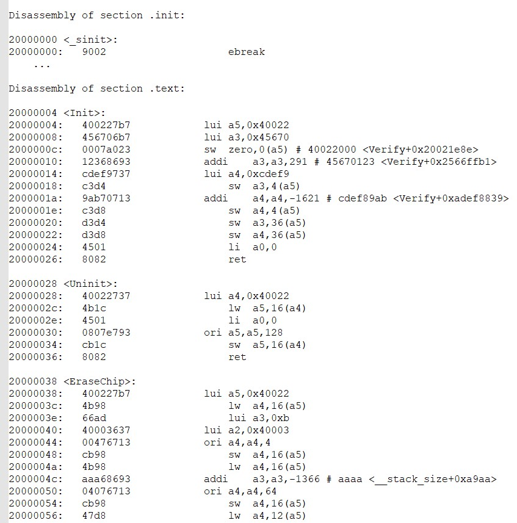

# Routine instructions

### The routine is based on CH32F103 to realize 1-wire debugging of CH32V003, which can realize pause, reset, read and write memory and registers of CH32V003, and realize programming of CH32V003 FLASH.

### The FLASH programming uses the programming code to run in the 003 RAM, and controls the 003 program running process through the debugging interface to realize the unlocking, erasing, and fast page programming of its own FLASH.

### The code running in RAM is detailed in the project CH32V003_FlashPrg_IN_RAM. The starting address of each independent function can be queried from the list file of the project. The program puts an "ebreak" instruction at the beginning of RAM. The return address of each function controlled by the debugger is this instruction. This instruction can ensure that the debug mode is entered again after each execution, as follows:

### The programming code of FLASH can be generated with one click through the tool of BIN to array, and stored in the project of the debugger. For the modification of the execution process and the setting of the dcsr register, refer to the routine CH32V003_1Line_SDIO_Program_Base_on_CH32F103.

