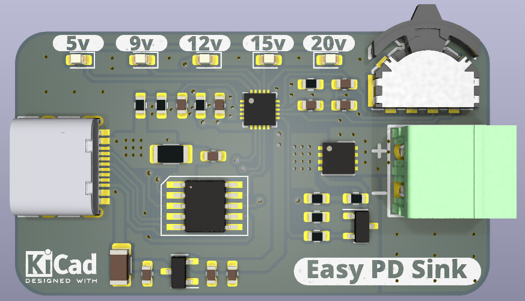

# Easy_PD_Sink

Power management systems are crucial for powering up our devices and especially for testing electronics, however, they can be bulky as noticed here by this power supply. There will come a situation whereby we want a more portable power solution and that is when the Easy_PD system comes into play.

The main working principle behind this is an ecosystem of two chips, the CH32V003, which is a small MCU, and also the CH224K. The two systems can be joined together to create a system that can request different voltages from the main source, which in this case would be our charger. 
