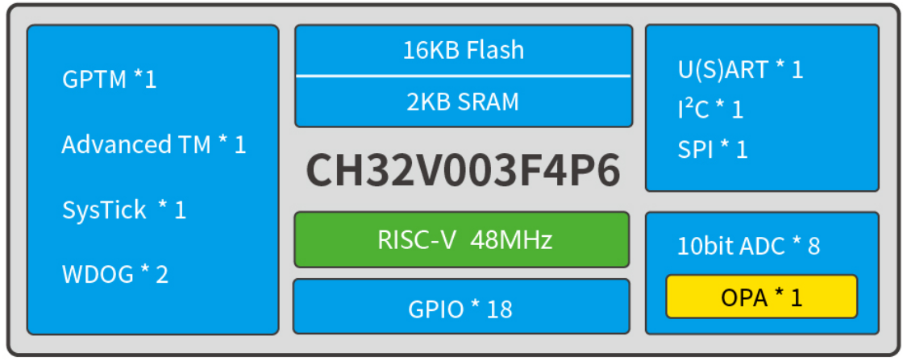

# 32-bit general-purpose RISC-V MCU-CH32V003
EN | [中文](README_zh.md)

### Overview
The CH32V003 series is an industrial-grade general-purpose microcontroller designed based on the RISC-V2A core of barley. It supports a system clock frequency of 48MHz and features wide voltage tolerance, single-wire debugging, low power consumption, and ultra-small packaging. It provides common peripheral functions, including a built-in DMA controller, a 10-bit analog-to-digital converter (ADC), a comparator, multiple timers, and standard communication interfaces such as USART, I2C, and SPI. The product is rated for operating voltages of 3.3V or 5V, with an industrial-grade temperature range of -40°C to 85°C

### System Block Diagram

### Features
- QingKe 32-bit RISC-V2A processor, supporting 2 levels of interrupt nesting
- Maximum 48MHz system main frequency
- 2KB SRAM, 16KB Flash
- Power supply voltage: 3.3/5V
- Multiple low-power modes: Sleep, Standby
- Power on/off reset, programmable voltage detector
- 1 group of 1-channel general-purpose DMA controller
- 1 group of op-amp comparator
- 1 group of 10-bit ADC
- 1×16-bit advanced-control timer, 1×16-bit general-purpose timer
- 2 WDOG, 1×32-bit SysTick
- 1 USART interface, 1 group of I2C interface, 1 group of SPI interface
- 18 I/O ports, mapping an external interrupt
- 96-bit chip unique ID
- 1-wire serial debug interface (SDI)
- Package: TSSOP20, QFN20, SOP16, SOP8
