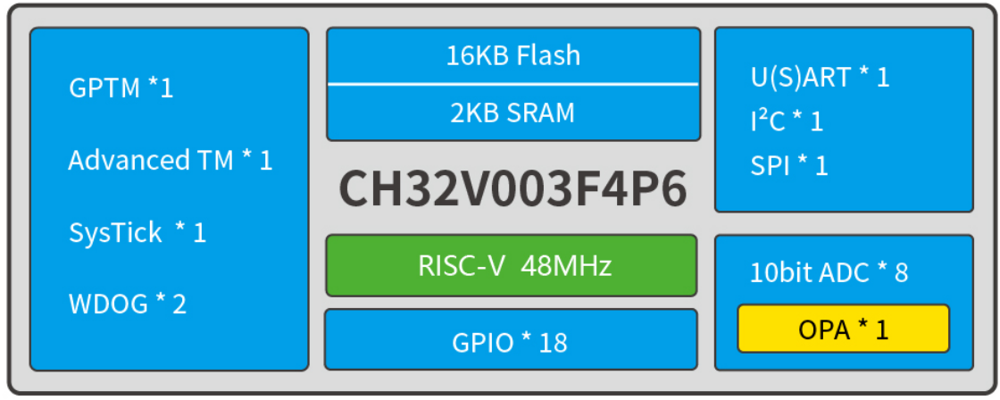

# 32位通用型RISC-V单片机 CH32V003

[EN](README.md) | 中文

### 概述

CH32V003系列是基于青稞RISC-V2A内核设计的工业级通用微控制器，支持48MHz系统主频，具有宽压、单线调试、低功耗、超小封装等特点。CH32V003系列内置1组DMA控制器、1组10位模数转换ADC、1组运放比较器、多组定时器以及标准通讯接口USART、IIC、SPI等。

### 系统框图

### 产品特点

- 青稞32位RISC-V2A处理器，支持2级中断嵌套
- 最高48MHz系统主频
- 2KB SRAM，16KB Flash
- 供电电压：3.3/5V
- 多种低功耗模式：睡眠、待机
- 上/下电复位、可编程电压检测器
- 1组1路通用DMA控制器
- 1组运放比较器
- 1组10位ADC
- 1个16位高级定时器和1个16位通用定时器
- 2个看门狗定时器和1个32位系统时基定时器
- 1个USART接口、1组IIC接口、1组SPI接口
- 18个I/O口，映像一个外部中断
- 64位芯片唯一ID
- 串行单线调试接口
- 封装形式：TSSOP20、QFN20、SOP16、SOP8
